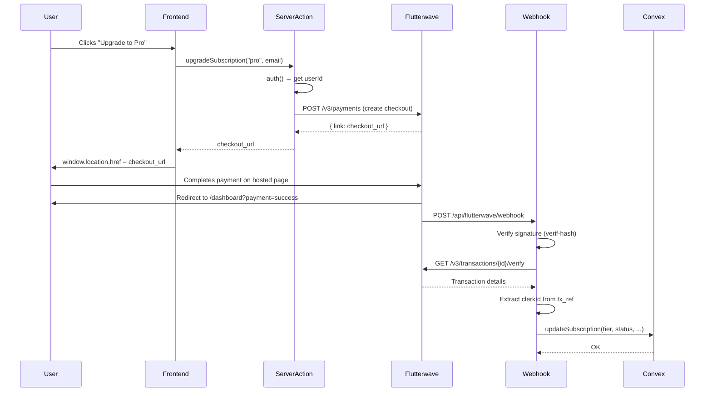
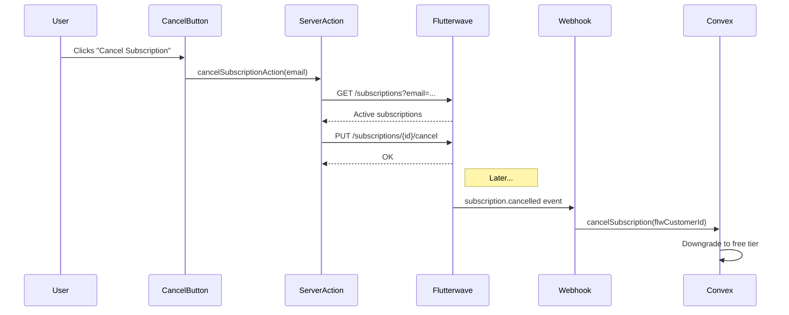

# StepEase — Complete Codebase & Payment System Deep Analysis

> **Date**: 2026-05-01  
> **Deployment Analyzed**: Development (`quixotic-meerkat-522.convex.cloud`)  
> **Production**: `vivid-chickadee-210.convex.cloud` (empty — no tables/data deployed yet)

---

## 1. Overall Architecture

### Tech Stack

| Layer | Technology | Version |
|-------|-----------|---------|
| Framework | Next.js (App Router) | 16.0.10 |
| Runtime | React | 19.2.3 |
| Database / Backend | Convex | 1.31.3 |
| Auth | Clerk | 6.36.5 |
| Payments | Flutterwave V3 | REST API |
| AI | Vercel AI SDK (Google, Groq, OpenAI-compatible) | 6.x |
| Styling | Tailwind CSS | 4.x |
| UI Components | shadcn/ui (Radix primitives) | Various |
| Analytics | Vercel Analytics | 1.3.1 |

### Directory Structure

```
Stepease/
├── app/                    # Next.js App Router
│   ├── actions/            # Server actions (payment.ts)
│   ├── api/                # API routes
│   │   └── flutterwave/webhook/route.ts
│   ├── create/             # SOP creation page
│   ├── dashboard/          # User dashboard
│   ├── improve/            # SOP improvement page
│   ├── library/            # SOP library
│   ├── preview/            # SOP preview
│   ├── review/             # SOP review
│   ├── settings/           # User settings
│   ├── share/              # Public SOP sharing
│   └── page.tsx            # Landing page (17KB)
├── components/             # UI components (15 subdirectories)
│   ├── pricing/            # 5 files (pricing section, modal, badge, card)
│   ├── settings/           # 3 files (plans panel, cancel button, watermark)
│   └── ...
├── convex/                 # Backend functions
│   ├── schema.ts           # Database schema (110 lines)
│   ├── users.ts            # User & subscription logic (478 lines)
│   ├── sessions.ts         # Session lifecycle (283 lines)
│   ├── sops.ts             # SOP CRUD (318 lines)
│   ├── activity.ts         # Audit logging (69 lines)
│   ├── migrations.ts       # One-time data fixes (110 lines)
│   └── cleanup.ts          # Duplicate notes cleanup (39 lines)
├── lib/
│   ├── flutterwave/        # Payment integration (7 files)
│   ├── sop-context.tsx      # SOP AI context (23KB — LARGE)
│   ├── sop-system-prompt.ts # AI system prompt (26KB — LARGE)
│   └── ...
├── hooks/                  # Custom React hooks (2 files)
└── middleware.ts           # Route protection (28 lines)
```

---

## 2. Database Schema & Data

### Tables (4 total)

| Table | Purpose | Indexes | Records (Dev) |
|-------|---------|---------|---------------|
| `users` | User accounts + subscription state | `by_clerk_id`, `by_flw_customer` | **4** |
| `sessions` | Active AI drafting workflows | `by_user` | Multiple |
| `sops` | Finalized SOPs | `by_user`, `by_parent`, `by_share_token` | Multiple |
| `activity_log` | Audit trail | `by_user`, `by_sop` | **2** |

### Users Table Schema (Payment-Critical)

```typescript
users: {
  clerkId: string,          // Clerk identity
  email: string,
  
  // Subscription
  tier: "free" | "starter" | "pro",
  status: "active" | "past_due" | "canceled" | "unpaid",
  
  // Flutterwave
  flwCustomerId?: string,
  flwSubscriptionId?: string,
  
  // Usage Tracking
  sopsCreatedThisMonth: number,
  improvesUsedThisMonth: number,
  usageResetAt: string,     // ISO date
  
  // Branding (Pro only)
  customWatermark?: string,
  watermarkEnabled?: boolean,
}
```

---

## 3. Live Database User & Payment Analysis

### All Users in Development Database

| # | Email | Tier | Status | FLW Customer ID | FLW Sub ID | SOPs Used | Improves Used | Usage Reset | Watermark |
|---|-------|------|--------|-----------------|------------|-----------|---------------|-------------|-----------|
| 1 | hembitec@gmail.com | **Pro** ✅ | active | 3468090 | 10017863 | 1 | 0 | 2026-05-01 | "HembITec" (enabled) |
| 2 | mujeebfadare@gmail.com | **Starter** ✅ | active | 3468084 | 10017828 | 2 | 0 | 2026-03-01 ⚠️ | — |
| 3 | davidadeleye2001@gmail.com | **Free** | active | — | — | 1 | 0 | 2026-03-01 ⚠️ | — |
| 4 | mujeebfadare01@gmail.com | **Free** | active | — | — | 9 ⚠️ | 3 ⚠️ | 2026-04-01 ⚠️ | — |

### Subscription Summary

| Metric | Count |
|--------|-------|
| **Total Users** | 4 |
| **Paying Users (Starter + Pro)** | **2** (50%) |
| **Pro Subscribers** | **1** (hembitec@gmail.com) |
| **Starter Subscribers** | **1** (mujeebfadare@gmail.com) |
| **Free Tier Users** | **2** |
| **Users with Flutterwave IDs** | **2** |
| **Monthly Revenue** | **$108** ($79 Pro + $29 Starter) |

### Payment Events

Based on Flutterwave subscription IDs in the database:
- **hembitec@gmail.com**: 1 confirmed payment (FLW Sub ID: `10017863`, Customer: `3468090`) → **Pro tier**
- **mujeebfadare@gmail.com**: 1 confirmed payment (FLW Sub ID: `10017828`, Customer: `3468084`) → **Starter tier**

> [!IMPORTANT]
> **No payment history table exists.** Flutterwave stores only the *latest* subscription ID on the user record. There is no `payments` or `transactions` table to track: how many times a user has paid, payment dates, payment amounts, failed payments, refunds, or tier changes over time. The only indicators of payment are the presence of `flwCustomerId` and `flwSubscriptionId` fields.

### Activity Log (Full Contents)

Only **2 entries** exist in the activity log, both by hembitec@gmail.com:
1. `exported` — "Exported as PDF" — *Item Organization and Storage Procedure* (2026-03-01)
2. `exported` — "Exported as DOCX" — *Client Website Handover and Configuration Guide* (2026-04-30)

> [!WARNING]
> **No payment-related activity is logged.** Subscription changes (upgrades, downgrades, cancellations) are NOT recorded in the activity log. The webhook handler doesn't log to the activity table.

---

## 4. Payment System Architecture — Deep Dive

### 4.1 Payment Flow



### 4.2 Cancellation Flow



### 4.3 File-by-File Breakdown

#### Backend: `lib/flutterwave/` (7 files, well-modularized ✅)

| File | Size | Purpose | Quality |
|------|------|---------|---------|
| [config.ts](file:///home/hembi/Desktop/Stepease/lib/flutterwave/config.ts) | 32 lines | API keys, base URL, plan IDs | ✅ Clean, has `validateConfig()` |
| [auth.ts](file:///home/hembi/Desktop/Stepease/lib/flutterwave/auth.ts) | 38 lines | Bearer token auth, generic `flwRequest` helper | ✅ Clean, reusable |
| [plans.ts](file:///home/hembi/Desktop/Stepease/lib/flutterwave/plans.ts) | 64 lines | Tier definitions, `getPlanByAmount()` | ✅ Clean, single source of truth |
| [checkout.ts](file:///home/hembi/Desktop/Stepease/lib/flutterwave/checkout.ts) | 61 lines | Create hosted checkout session | ✅ Clean |
| [verify.ts](file:///home/hembi/Desktop/Stepease/lib/flutterwave/verify.ts) | 46 lines | Transaction verification (by ID and by ref) | ✅ Clean |
| [webhook.ts](file:///home/hembi/Desktop/Stepease/lib/flutterwave/webhook.ts) | 61 lines | Signature verification, payload parsing | ✅ Clean |
| [index.ts](file:///home/hembi/Desktop/Stepease/lib/flutterwave/index.ts) | 7 lines | Barrel exports | ✅ Clean |

#### Webhook Route: [route.ts](file:///home/hembi/Desktop/Stepease/app/api/flutterwave/webhook/route.ts) (186 lines)

| Aspect | Assessment |
|--------|-----------|
| Signature verification | ✅ Uses `verif-hash` header (correct for FLW) |
| Transaction re-verification | ✅ Double-checks with FLW API |
| tx_ref parsing | ✅ Extracts clerkId from `sub_user_xxx_timestamp` |
| Plan detection | ✅ `getPlanByAmount()` — maps price to tier |
| Cancellation handling | ✅ Handles `subscription.cancelled` events |
| Error handling | ✅ Try/catch with appropriate status codes |
| Logging | ⚠️ Heavy `console.log` — fine for dev, noisy for production |
| Idempotency | ⚠️ Partial — cancellation is idempotent, upgrades always reset usage |

#### Server Action: [payment.ts](file:///home/hembi/Desktop/Stepease/app/actions/payment.ts) (107 lines)

| Aspect | Assessment |
|--------|-----------|
| Auth check | ✅ Uses `auth()` from Clerk |
| `upgradeSubscription()` | ✅ Clean, returns checkout URL |
| `handlePaymentSuccess()` | ⚠️ Essentially a no-op — just returns success message |
| `cancelSubscriptionAction()` | ✅ Queries FLW API, cancels active sub |
| Error handling | ✅ Returns structured `{ success, message }` |

#### Convex Backend: [users.ts](file:///home/hembi/Desktop/Stepease/convex/users.ts) (478 lines)

| Function | Type | Purpose | Assessment |
|----------|------|---------|-----------|
| `getOrCreate` | mutation | Auto-provision user on sign-in | ✅ Idempotent, defaults to free |
| `getByClerkId` | query | Fetch current user | ✅ Clean |
| `checkCanCreate` | query | Limit check for SOP creation | ✅ Proper limit math |
| `checkCanImprove` | query | Limit check for improve feature | ✅ Proper limit math |
| `incrementSopCount` | mutation | Increment after SOP creation | ✅ Auto-resets on month boundary |
| `incrementImproveCount` | mutation | Increment after improve usage | ✅ Auto-resets on month boundary |
| `updateSubscription` | mutation | Webhook-called tier update | ✅ Secret-key auth, resets usage |
| `cancelSubscription` | mutation | Webhook-called downgrade | ✅ Idempotent, clears sub ID |
| `resetMonthlyUsage` | internalMutation | Cron job for monthly reset | ⚠️ No cron schedule configured |
| `syncUsageFromSessions` | mutation | One-time backfill | ⚠️ Counts ALL sessions, not user-scoped |
| `getWatermarkSettings` | query | Pro watermark config | ✅ Clean |
| `updateWatermarkSettings` | mutation | Pro watermark update | ✅ Tier-gated |

#### Frontend Components

| Component | Size | Purpose | Assessment |
|-----------|------|---------|-----------|
| [pricing-section.tsx](file:///home/hembi/Desktop/Stepease/components/pricing/pricing-section.tsx) | 209 lines | Landing page pricing cards | ⚠️ Hardcoded plan data (not from `PLANS`) |
| [upgrade-modal.tsx](file:///home/hembi/Desktop/Stepease/components/pricing/upgrade-modal.tsx) | 168 lines | In-app upgrade dialog | ✅ Uses `PLANS`, calls server action |
| [subscription-card.tsx](file:///home/hembi/Desktop/Stepease/components/pricing/subscription-card.tsx) | 121 lines | Dashboard usage card | ✅ Progress bars, clean UI |
| [upgrade-badge.tsx](file:///home/hembi/Desktop/Stepease/components/pricing/upgrade-badge.tsx) | 43 lines | Sidebar CTA badge | ✅ Clean, responsive |
| [settings-plans-panel.tsx](file:///home/hembi/Desktop/Stepease/components/settings/settings-plans-panel.tsx) | 174 lines | Settings billing tab | ⚠️ Duplicates upgrade logic from modal |
| [cancel-subscription-button.tsx](file:///home/hembi/Desktop/Stepease/components/settings/cancel-subscription-button.tsx) | 67 lines | Subscription cancellation | ✅ Clean, confirmation UX |
| [watermark-settings.tsx](file:///home/hembi/Desktop/Stepease/components/settings/watermark-settings.tsx) | 126 lines | Pro PDF branding | ✅ Clean, tier-gated |

---

## 5. Code Quality & Modularity Assessment

### ✅ What's Done Well

1. **Flutterwave library is excellently modularized** — 7 small, focused files with barrel exports. Each handles one concern (config, auth, checkout, verify, webhook, plans).

2. **Schema is clean and well-typed** — Strong use of Convex unions (`tier: "free" | "starter" | "pro"`) and proper indexes.

3. **Security layers are correct** — Webhook uses `verif-hash` verification + transaction re-verification. Convex mutations use `CONVEX_WEBHOOK_SECRET` for unauthenticated webhook calls.

4. **Middleware properly exempts the webhook route** — `/api/flutterwave/webhook` is in the public routes list, so Clerk doesn't block Flutterwave's POST.

5. **Usage limit enforcement is dual-layered** — Both frontend UI gating (query checks) and server-side mutation checks in `sessions.create`.

6. **`PLAN_LIMITS` constant is well-defined** — Single source of truth for limits, used in both `users.ts` and `sessions.ts`.

7. **Cancellation flow is complete** — Client-side cancel button → FLW API cancellation → webhook-driven Convex downgrade. Two-step confirmation UX is good.

### ⚠️ Issues & Concerns

#### Critical

| # | Issue | Location | Impact |
|---|-------|----------|--------|
| 1 | **No payment/transaction history table** | Schema | Cannot track: payment count, payment dates, failed payments, refunds, tier change history. You literally cannot answer "how many times has a user paid?" |
| 2 | **`usageResetAt` is stale for 2 users** | DB data | Users #2 and #3 have `usageResetAt: "2026-03-01"` — **2 months behind**. Their usage hasn't been reset. |
| 3 | **User #4 exceeds free tier limits** | DB data | `mujeebfadare01@gmail.com` is on free tier but has `sopsCreatedThisMonth: 9` and `improvesUsedThisMonth: 3`. Free tier allows 2 creates and 0 improves. Data integrity violation. |
| 4 | **`resetMonthlyUsage` cron is never scheduled** | `convex/` | The internalMutation exists but no cron job is configured in `convex/crons.ts` (file doesn't exist). Users rely on lazy-reset in `incrementSopCount`/`incrementImproveCount`, but if they never create, counts stay stale. |
| 5 | **`PLAN_LIMITS` is duplicated** | `users.ts` L6-10, `sessions.ts` L32-36 | Exact same constant in two files. If one changes, the other won't. Should be in a shared module. |

#### Moderate

| # | Issue | Location | Impact |
|---|-------|----------|--------|
| 6 | **`pricing-section.tsx` hardcodes plan data** | Component | Pricing cards on the landing page use inline data, not the canonical `PLANS` object. Prices/features could drift out of sync. |
| 7 | **`settings-plans-panel.tsx` duplicates upgrade logic** | Component | Same `handleUpgrade` pattern as `upgrade-modal.tsx`. Should share a hook or utility. |
| 8 | **`syncUsageFromSessions` is not user-scoped** | `users.ts` L363 | Counts ALL sessions globally (`ctx.db.query("sessions").collect()`), not just the current user's. Backfill would assign incorrect counts. |
| 9 | **No payment event logging** | Webhook route | `updateSubscription` and `cancelSubscription` don't write to `activity_log`. You can't audit when subscriptions changed. |
| 10 | **Webhook `console.log` pollution** | `route.ts` | 8+ console.log statements will be noisy in production. Should use structured logging or at least conditional logging. |
| 11 | **Yearly billing teaser is misleading** | `pricing-section.tsx` L139 | Shows "Save 17% with yearly billing" but yearly billing is not implemented. |
| 12 | **`handlePaymentSuccess` server action is a no-op** | `payment.ts` L47-63 | Does nothing — just returns a success message. Could be removed or should verify actual subscription state. |
| 13 | **Production database is empty** | Prod deployment | `vivid-chickadee-210` has no tables deployed. Production is not configured. |

#### Minor

| # | Issue | Location | Impact |
|---|-------|----------|--------|
| 14 | **`getOrCreateUserForIncrement` uses `any` types** | `users.ts` L398 | Helper function has `ctx: any, identity: any` — loses type safety. |
| 15 | **`cleanup.ts` has no auth** | Convex | The `cleanupDuplicateNotes` mutation can be called by anyone. Should be `internalMutation`. |
| 16 | **`checkout.ts` doesn't use `flwRequest` helper** | `lib/flutterwave` | The checkout function manually constructs the fetch call instead of using the reusable `flwRequest` from auth.ts. |
| 17 | **No downgrade path in UI** | Components | Users can cancel (goes to free), but there's no UI to downgrade from Pro to Starter. Only upgrades are supported. |

---

## 6. Payment Data Integrity Deep Dive

### User-by-User Analysis

#### 1. hembitec@gmail.com (YOU — Pro)
- **Status**: ✅ Healthy  
- **Tier**: Pro ($79/mo)
- **FLW Customer**: `3468090`, Subscription: `10017863`
- **Usage**: 1 SOP created, 0 improves this month
- **Reset date**: 2026-05-01 ✅ (current)
- **Watermark**: "HembITec", enabled
- **Notes**: This is the only fully healthy user record.

#### 2. mujeebfadare@gmail.com (Starter)
- **Status**: ⚠️ Stale usage reset
- **Tier**: Starter ($29/mo)
- **FLW Customer**: `3468084`, Subscription: `10017828`
- **Usage**: 2 SOPs created (within 12 limit), 0 improves (within 5 limit)
- **Reset date**: **2026-03-01** ⚠️ — 2 months overdue. The `sopsCreatedThisMonth: 2` may be from March, never reset.
- **Risk**: Next time they create a SOP, the lazy-reset in `incrementSopCount` will fire, but until then the counter is meaningless.

#### 3. davidadeleye2001@gmail.com (Free)
- **Status**: ⚠️ Stale usage reset
- **Tier**: Free ($0)
- **Payment**: None (no FLW IDs)
- **Usage**: 1 SOP created (within 2 limit)
- **Reset date**: **2026-03-01** ⚠️ — 2 months overdue.

#### 4. mujeebfadare01@gmail.com (Free — DATA INTEGRITY ISSUE)
- **Status**: 🔴 **Limit exceeded**
- **Tier**: Free ($0)
- **Payment**: None (no FLW IDs)
- **Usage**: **9 SOPs created** (limit: 2), **3 improves used** (limit: 0)
- **Reset date**: **2026-04-01** ⚠️ — 1 month overdue
- **Analysis**: This user has FAR exceeded free tier limits. This could be because:
  1. The `syncUsageFromSessions` mutation was run (it counts ALL sessions, not user-scoped)
  2. Limit checks were added after this user was already active
  3. There's a race condition in the limit enforcement

---

## 7. What's Missing for a Production Payment System

| Feature | Status | Priority |
|---------|--------|----------|
| **Payment history table** | ❌ Missing | 🔴 Critical |
| **Cron job for usage reset** | ❌ No `crons.ts` | 🔴 Critical |
| **Payment activity logging** | ❌ Not logged | 🟡 High |
| **Subscription change audit trail** | ❌ Not tracked | 🟡 High |
| **Idempotent webhook processing** | ⚠️ Partial | 🟡 High |
| **Failed payment handling** | ❌ Only "successful" is processed | 🟡 High |
| **Grace period for past_due** | ❌ Not implemented | 🟡 Medium |
| **Receipt/invoice emails** | ❌ Not implemented | 🟡 Medium |
| **Downgrade tier path (Pro→Starter)** | ❌ Not in UI | 🟢 Low |
| **Annual billing support** | ❌ Teased but not built | 🟢 Low |
| **Admin dashboard for payment data** | ❌ Not built | 🟢 Low |

---

## 8. Summary

### The Good
The Flutterwave integration is **well-architected and cleanly modularized**. The `lib/flutterwave/` directory follows best practices with clear separation of concerns (config, auth, checkout, verify, webhook, plans). The webhook handler has proper security layers (signature verification + transaction re-verification). The schema is well-typed with Convex unions.

### The Concerning
The system has **no payment history tracking** — the biggest gap. You can see *who* is paying *now*, but you cannot see *when* they started, *how many times* they've paid, or any payment timeline. The `usageResetAt` dates are stale for 3 of 4 users because no cron job runs the `resetMonthlyUsage` function. One free-tier user has far exceeded their limits, suggesting enforcement was added retroactively or the sync function corrupted counts.

### The Bottom Line
For a development/MVP stage, this is solid work. For production, the payment system needs a **transactions/payment_history table**, a **scheduled cron for usage resets**, and **activity logging for subscription changes** before you can confidently track revenue, debug payment issues, or answer business questions about subscriber behavior.
